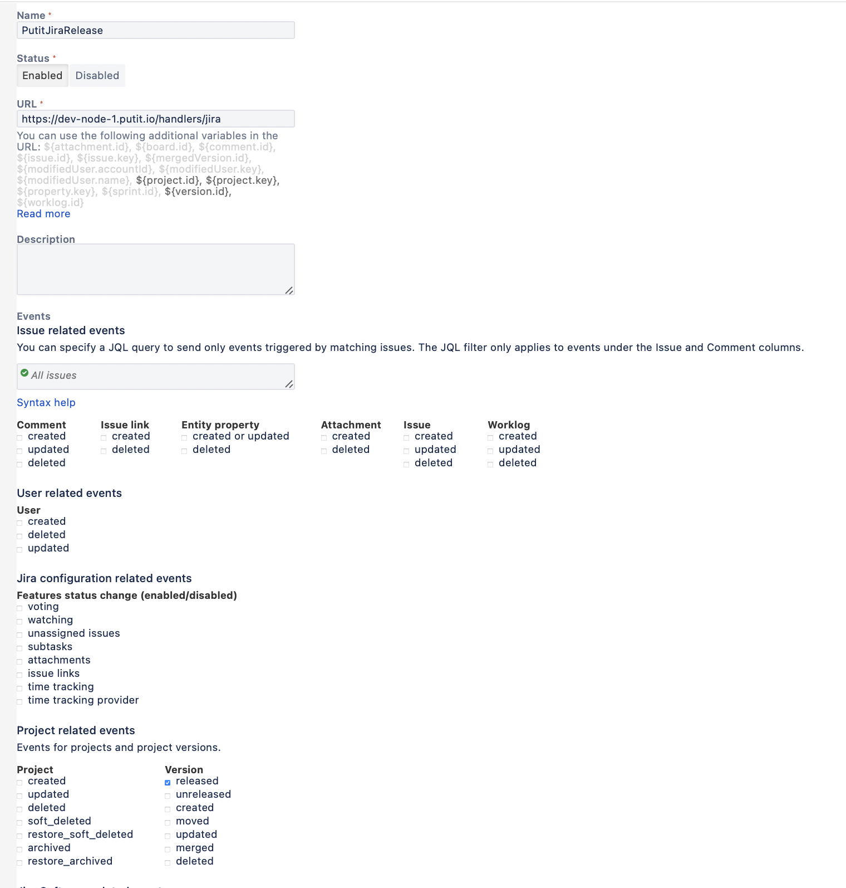

## Putit JIRA plugin

Every organization has its own unique way to deploy software. They can be similar in many ways, however there's no silver bullet and there's also no one-size-fits-all solution.

Putit aims to help organizations by providing plugins for most popular software that could be use in the organization, like JIRA.

## Plugin's anatomy

Putit JIRA plugin is a simple HTTP listener - so JIRA could trigger it every time "Release" has been released.

### Webhook configuration

Simple webhook needs to be added to JIRA, as shown on a picture below:


### JIRA username and password

Plugin will need to query JIRA for more information therefore it is required to provide username and password.

It needs to be added to the configuration file XXXXX

## Flow

1. Incoming webhook triggers plugin's handler with following payload:
```json
{
    "timestamp": 1599604370956,
    "webhookEvent": "jira:version_released",
    "version": {
        "self": "https://putit.atlassian.net/rest/api/2/version/10000",
        "id": "10000",
        "description": "",
        "name": "1.0",
        "archived": false,
        "released": true,
        "overdue": false,
        "userReleaseDate": "09/Sep/20",
        "projectId": 10002
    }
}
```
2. Plugin logs information about webhook for compliance and troubleshooting reason.
3. Plugin creates "JIRA release" object which will be used to create joint between Change and JIRA release for further tracking in JIRA.: